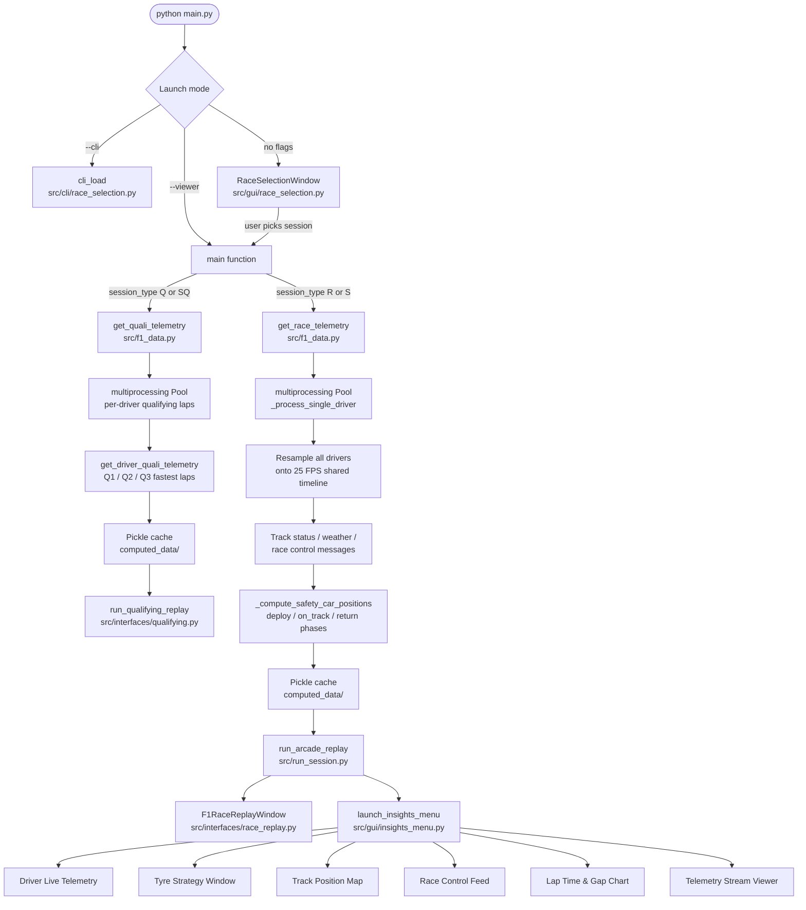

# F1 Telemetry Visualizer

[](https://github.com/isidhartha/f1-telemetry-visualizer/discussions)

A desktop application that replays Formula 1 race and qualifying sessions as animated, frame-by-frame visualizations. It fetches official telemetry from the FastF1 API, processes all drivers in parallel using Python multiprocessing, and renders the result as a real-time arcade-style replay window alongside a suite of live insight panels built with PySide6.

**Author:** Ram Sidhartha

---

## Features

- **PySide6 GUI session selector** — browse the full F1 calendar from 2018 onward, filter by year or race name, and launch any session (Race, Sprint, Qualifying, Sprint Qualifying) from a tree-view interface
- **Arcade replay engine** — 25 FPS animated track map powered by the `arcade` library, showing all drivers simultaneously with official team colors
- **Parallel telemetry processing** — each driver's lap-by-lap telemetry is processed concurrently using `multiprocessing.Pool` and resampled onto a shared timeline
- **Safety car simulation** — physics-based safety car position is computed for every frame, covering deploying, on-track (leading the field), and returning phases with smooth fade animations using a KD-Tree spatial lookup
- **DRS zone detection** — qualifying lap preferred for accurate DRS data; falls back to fastest race lap with speed-based detection when qualifying is unavailable
- **Pit stop detection** — per-driver pit windows (PitInTime / PitOutTime) are extracted and injected into every replay frame for leaderboard indicators
- **Weather data overlay** — track temperature, air temperature, humidity, wind speed, wind direction, and rain state are resampled and attached to each frame
- **Race control message feed** — FIA race control messages (flags, penalties, safety car, DRS, sector notices) are parsed and time-synchronized to the replay
- **Qualifying replay mode** — separate animated screen for qualifying sessions showing Q1/Q2/Q3 segments with per-driver fastest-lap telemetry and DRS zone overlays
- **Insights menu (PySide6)** — secondary floating window that launches individual live analysis panels:
  - Telemetry Stream Viewer
  - Driver Live Telemetry (speed, gear, throttle, braking)
  - Live Tyre Strategy (stint timeline and pit stop history per driver)
  - Track Position Map (live driver positions on real or circular layout)
  - Race Control Feed (flags, penalties, safety car status)
  - Lap Time and Gap Evolution chart
- **Pickle cache** — computed telemetry is saved to `computed_data/` so subsequent runs skip re-processing; use `--refresh-data` to force a fresh download
- **CLI mode** — `--cli` flag bypasses the GUI for headless or scripted usage
- **HUD toggle** — `--no-hud` hides the overlay for a clean track view
- **Settings dialog** — configurable FastF1 cache location persisted through the settings module

---

## Tech Stack

| Library | Purpose |
|---|---|
| `fastf1` | Official F1 telemetry and session data |
| `pandas` | Data manipulation and lap filtering |
| `numpy` | Array resampling and timeline construction |
| `matplotlib` | Supplementary plotting |
| `arcade` | 2D game-style animated replay window |
| `pyglet` | Underlying windowing layer used by arcade |
| `pyside6` | GUI session selector, insights panels, settings |
| `questionary` | Interactive CLI prompts |
| `rich` | Terminal formatting and output |

---

## Setup

```bash
pip install -r requirements.txt
python main.py
```

This opens the PySide6 GUI session selector. Choose a year and race weekend from the tree view, then click a session button (Race, Qualifying, Sprint, Sprint Qualifying) to load and launch the replay.

---

## CLI Usage

```bash
# List all rounds for a year

[](https://github.com/isidhartha/f1-telemetry-visualizer/discussions)
python main.py --list-rounds --year 2024

# List sprint rounds

[](https://github.com/isidhartha/f1-telemetry-visualizer/discussions)
python main.py --list-sprints --year 2024

# Launch a race session directly (bypasses GUI)

[](https://github.com/isidhartha/f1-telemetry-visualizer/discussions)
python main.py --viewer --year 2024 --round 5

# Launch a qualifying session

[](https://github.com/isidhartha/f1-telemetry-visualizer/discussions)
python main.py --viewer --year 2024 --round 5 --qualifying

# Launch a sprint session

[](https://github.com/isidhartha/f1-telemetry-visualizer/discussions)
python main.py --viewer --year 2024 --round 5 --sprint

# Launch sprint qualifying

[](https://github.com/isidhartha/f1-telemetry-visualizer/discussions)
python main.py --viewer --year 2024 --round 5 --sprint-qualifying

# Hide the HUD overlay

[](https://github.com/isidhartha/f1-telemetry-visualizer/discussions)
python main.py --viewer --year 2024 --round 5 --no-hud

# Force re-download of telemetry (bypass cache)

[](https://github.com/isidhartha/f1-telemetry-visualizer/discussions)
python main.py --viewer --year 2024 --round 5 --refresh-data

# Enable verbose FastF1 logging

[](https://github.com/isidhartha/f1-telemetry-visualizer/discussions)
python main.py --viewer --year 2024 --round 5 --verbose

# Run in headless CLI mode

[](https://github.com/isidhartha/f1-telemetry-visualizer/discussions)
python main.py --cli
```

---

## Code Architecture



---

## Project Structure

```
f1-telemetry-visualizer/
├── main.py                        # Entry point: GUI / CLI / viewer dispatch
├── requirements.txt
├── src/
│   ├── f1_data.py                 # FastF1 fetching, telemetry processing, caching
│   ├── run_session.py             # Launches arcade replay window and insights menu
│   ├── bayesian_tyre_model.py     # Tyre degradation modelling
│   ├── tyre_degradation_integration.py
│   ├── ui_components.py
│   ├── cli/
│   │   └── race_selection.py      # CLI session picker
│   ├── gui/
│   │   ├── race_selection.py      # PySide6 session selector window
│   │   ├── insights_menu.py       # Insights launcher floating panel
│   │   ├── pit_wall_window.py
│   │   └── settings_dialog.py
│   ├── insights/
│   │   ├── driver_telemetry_window.py
│   │   ├── lap_time_chart_window.py
│   │   ├── race_control_feed_window.py
│   │   ├── telemetry_stream_viewer.py
│   │   ├── track_position_window.py
│   │   └── tyre_strategy_window.py
│   ├── interfaces/
│   │   ├── race_replay.py         # Arcade F1RaceReplayWindow
│   │   └── qualifying.py          # Qualifying arcade replay
│   ├── lib/
│   │   ├── season.py
│   │   ├── settings.py
│   │   ├── time.py
│   │   └── tyres.py
│   └── services/
│       └── stream.py
└── computed_data/                 # Auto-created pickle cache directory
```

---

## Screenshots

_Screenshots coming soon._

---

## License

This project is licensed under the MIT License. See [LICENSE](LICENSE) for details.
