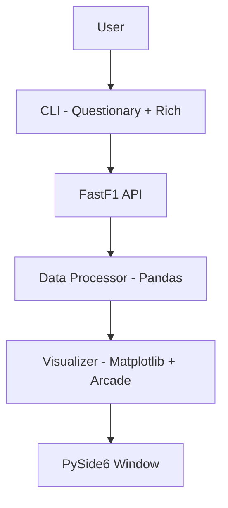

# F1 Telemetry Visualizer

A desktop application I built to replay Formula 1 race sessions using real telemetry data sourced directly from the FastF1 API. The app lets you step through any session lap-by-lap, visualize speed traces, inspect tyre compound changes, identify DRS activation zones, and compare multiple drivers side by side — all from a native PySide6 desktop window driven by an interactive terminal CLI.

---

## Features

- **Telemetry Replay** — Scrub through any F1 session (practice, qualifying, or race) and replay car telemetry frame-by-frame using cached FastF1 data.
- **Live Speed Traces** — Animated Matplotlib plots show speed vs. distance for each lap, updated in real time as the replay progresses.
- **Tyre Compound Overlays** — Colour-coded tyre compound indicators (Soft, Medium, Hard, Inter, Wet) are rendered directly on the speed trace and stint summary panel.
- **DRS Zones** — DRS detection zones and activation windows are highlighted on the circuit map and speed trace for every lap.
- **Multi-Driver Comparison** — Select up to four drivers and overlay their telemetry channels — speed, throttle, brake, and gear — on a single synchronized chart.
- **Lap-by-Lap Breakdown** — Paginated lap table shows sector times, compound, tyre age, pit flags, and cumulative gap, exportable to CSV.

---

## Tech Stack

| Tool | Purpose |
|---|---|
| Python 3.11+ | Core runtime |
| FastF1 | F1 session & telemetry data |
| Pandas | Data manipulation and alignment |
| Matplotlib | Speed trace and comparison charts |
| PySide6 | Native desktop GUI window |
| Arcade | Animated circuit map rendering |
| Questionary | Interactive terminal session selector |
| Rich | Formatted terminal output and tables |

---

## Setup

```bash
git clone https://github.com/ramsidhartha/f1-telemetry-visualizer.git
cd f1-telemetry-visualizer
pip install -r requirements.txt
python main.py
```

> **Note:** FastF1 downloads and caches session data on first run. Set `FASTF1_CACHE_DIR` in `.env` to control where the cache is stored.

Copy the environment file before running:

```bash
cp .env.example .env
```

---

## Architecture



---

## Screenshots

> 📸 Screenshots coming soon

---

## Author

**Ram Sidhartha**

---

## License

This project is licensed under the MIT License — see [LICENSE](LICENSE) for details.
